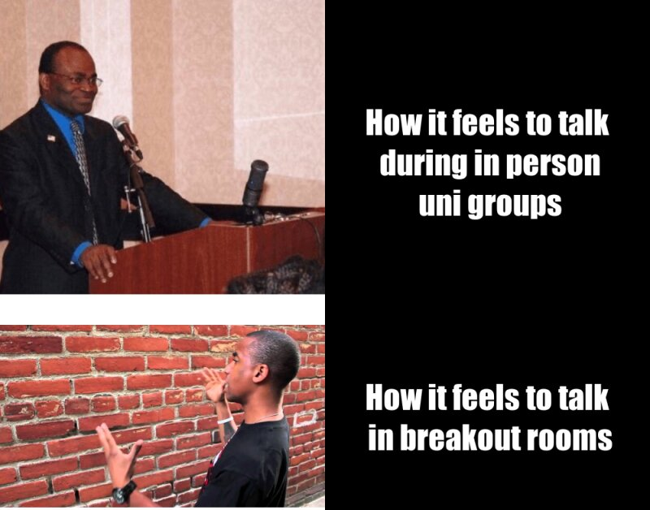

# Assignment 1A 
## *By Michael Walker*
**My meme**



The places I found the images for this meme
* I saw the first image on social media while scrolling through an accounts feed
* The second image was messaged to me as a gif by a friend while we were texing

The second image was originally a gif that came from [tenor](https://tenor.com/) 

There were a few things that inspired me to make the meme that I did
1. Frustrations with having to do group work via zoom
2.  Wanting to use orginal images for my meme, rather than just using a combination of images that had already been done
3.  I just think the images are funny

```
library(magick)
#square one
proud_podium <- image_read("https://i.imgflip.com/2f9ypc.jpg")%>%
  image_scale(500)

#square two
positive_text <- image_blank(width = 500,
                          height = 500,
                          color = "#000000") %>% 
image_annotate(text = "How it feels to talk\n during in person\n uni groups",
              color ="#FFFFFF",
              size = 50,
              font = "Impact",
              gravity = "center")

#square three 
brick_wall <- image_read("https://i.ytimg.com/vi/NVuL7mLqT6g/maxresdefault.jpg") %>%
  image_scale(500)

#square four 
negative_text <- image_blank(width = 500,
                             height = 285,
                             color = "#000000") %>%
  image_annotate(text = "How it feels to talk\n in breakout rooms",
                 color = "#FFFFFF",
                 size = 50,
                 font = "Impact",
                 gravity = "center")
#top row
podium_vector <- c(proud_podium, positive_text)
top_row <- image_append(podium_vector)

#bottom row
brick_vector <- c(brick_wall, negative_text)
bottom_row <- image_append(brick_vector)

#combining everything

meme <- c(top_row,bottom_row) %>%
  image_append(stack = TRUE) %>%
  image_scale(800)

meme

image_write(meme, "My_Meme2.png")
```
